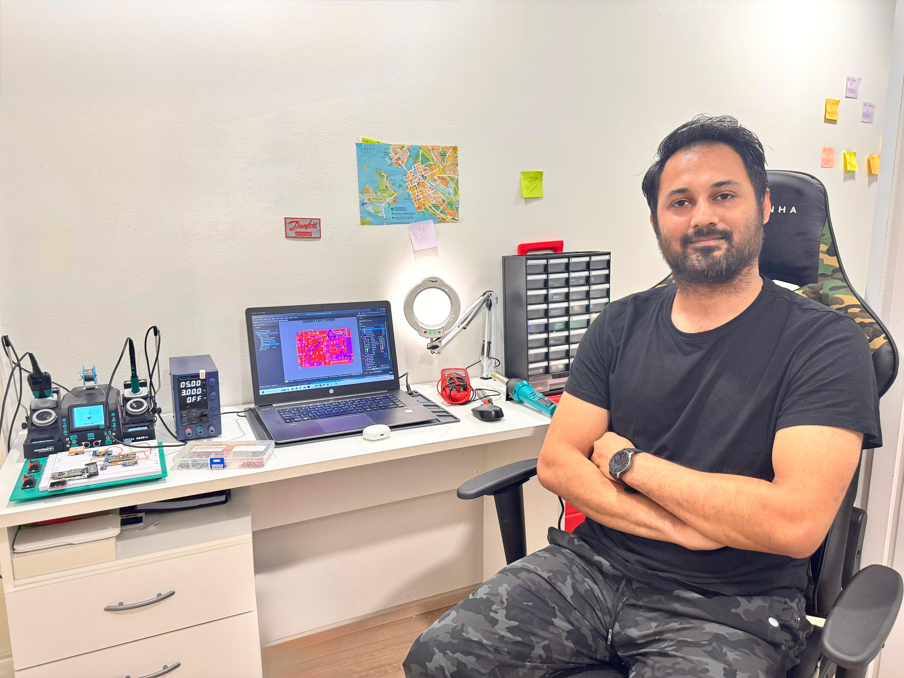

<h1 align="center">Hi, I'm Muhammad Zaeem Sarfraz</h1>
<h3 align="center">Electronics & IoT Hardware Engineer | Embedded Systems Developer | AI-Augmented Full-Stack Builder</h3>

  
  
  

---

  

### :wrench: About Me

I'm an **Electronics & IoT Hardware Engineer** based in **Vaasa, Finland**, currently completing my **MSc in Sustainable & Autonomous Systems** (University of Vaasa & University of Oulu). My core expertise is in **embedded systems, PCB design, and firmware development** -- I design and deliver IoT hardware products from concept through schematic design, PCB layout, firmware, testing, and **mass production**.

What sets me apart: I combine deep hardware engineering skills with **AI-augmented development** using tools like **Claude, GitHub Copilot, and AI terminal agents** to deliver complete end-to-end solutions -- including backend APIs and web dashboards -- even when those areas are outside my primary domain. I believe in solving the full problem, not just my slice of it.

- :office: **Currently:** Robotics Development Intern @ [Done Robotics Ltd](https://donerobotics.com/) -- designing embedded electronics for autonomous service robots
- :factory: **Previously:** Trainee Electronics Engineer @ [Danfoss Drives](https://www.danfoss.com/) -- PCB R&D, schematic design, OrCAD/Allegro
- :briefcase: **Freelance:** Level 2 Seller on Fiverr -- **20+ IoT hardware products** delivered to clients in USA, Ireland, Indonesia, India & more
- :microscope: **Personal Lab:** Own electronics lab in Vaasa with oscilloscope, SMT soldering station, power supply & full prototyping setup
- :mortar_board: **Scholarship:** Finland Scholarship for academic excellence (top student in batch)

---

### :dart: Core Expertise vs AI-Augmented Skills

I believe in being transparent about where my deep expertise lies and where I leverage AI tools to extend my capabilities.

**:muscle: Core Expertise (Hands-on, Deep Knowledge)**

These are the skills I've built over years of hands-on work, education, and professional experience:

- **PCB Design & Hardware** -- Schematic design, multi-layer PCB layout, Gerber generation, BOM preparation, SMD/THT soldering, derating analysis, prototype assembly and testing
- **Embedded Firmware** -- C/C++ on ESP32/ESP8266, Arduino, Raspberry Pi, NRF52840. Sensor integration (I2C, SPI, UART), actuator control, deep-sleep power optimization, MOSFET power switching
- **IoT Protocols** -- MQTT, BLE, Wi-Fi, HTTP, RS485. End-to-end IoT product development from sensor to cloud
- **Circuit Design** -- Analog/digital circuits, LTSpice/MultiSim simulation, power supply design, signal conditioning
- **Robotics & Mechatronics** -- Cross-functional hardware-software integration for autonomous systems (Done Robotics)
- **AI/ML on Edge** -- TensorFlow Lite for on-device inference (fire alarm sound pattern detection)
- **Lab Skills** -- Own electronics lab: oscilloscope, SMT rework station, multimeter, IC programmers, full prototyping capability

**:robot: AI-Augmented Skills (Built with AI Tools)**

I use **Claude AI, GitHub Copilot, and AI terminal agents** as force multipliers to deliver complete solutions. These are areas where I understand the architecture and requirements, and use AI tools to implement, debug, and iterate:

- **Web Dashboards** -- Built real-time React/TypeScript dashboards for my IoT projects using AI-assisted development
- **Backend APIs** -- Created FastAPI backends for sensor data ingestion and analytics with AI pair-programming
- **Desktop Applications** -- Developed Bluetooth and USB Serial desktop apps for the Altimeter project

> :bulb: **My philosophy:** As a hardware engineer, my job doesn't stop at the PCB edge. When a project needs a web dashboard or a backend API, I use AI tools to build production-quality software -- because the client needs a complete solution, not excuses about what's "not my department." I understand the system architecture, define the requirements, and use AI to help me implement, review, and iterate until it works.

---

### :rocket: Featured Projects

| Project | Description | Built With |
|---------|-------------|------------|
| :seedling: [**Plant Sensor Network**](https://github.com/zaeem7744/Plant-Sensor-Network) | Full-stack IoT system with 13 sensors, ~92% power savings, I2C multiplexing | **Core:** ESP32-S3 firmware, PCB, sensors. **AI-assisted:** FastAPI backend + React dashboard |
| :fire: [**Fire Alarm Detector**](https://github.com/zaeem7744/FireAlarm_Detector) | On-device ML for fire alarm sound detection with cloud alerts | **Core:** ESP32 firmware, TensorFlow Lite, hardware design, Blynk IoT |
| :watch: [**TapBand -- IoT Wearable**](https://github.com/zaeem7744/TapBand-Firmware-and-PCB) | 5cm x 3cm MQTT wearable -- **currently in mass production** | **Core:** ESP32 firmware, Altium PCB, deep-sleep. **AI-assisted:** Web dashboard |
| :mountain_snow: [**Altimeter System**](https://github.com/zaeem7744/Altimeter-Firmware-and-Design) | Altitude device with BLE & USB + custom PCB | **Core:** ESP32/NRF52840 firmware, Altium PCB. **AI-assisted:** Desktop apps |
| :sunny: [**Solar Gong Valve**](https://github.com/zaeem7744/Solar-Gong-Solenoid-Valve) | Solar-powered automatic solenoid valve controller | **Core:** ESP32 firmware, circuit design, solenoid control |

**Ecosystem repos:**
[Plant Sensor Backend](https://github.com/zaeem7744/Plant-Sensor-Network-Backend) (FastAPI + SQLite) | [Plant Sensor Dashboard](https://github.com/zaeem7744/Plant-Sensor-Network-Web-Dashboard) (React + TypeScript) | [TapBand Dashboard](https://github.com/zaeem7744/TapBand-Web-Dashboard) (React + TypeScript) | [Altimeter App (BLE)](https://github.com/zaeem7744/Altimeter_Desktop_App_Bluetooth) | [Altimeter App (USB)](https://github.com/zaeem7744/Altimeter_Desktop_App_USB_Serial)

---

### :briefcase: Work Experience

| Role | Company | Location | Period |
|------|---------|----------|--------|
| **Robotics Development Intern** | Done Robotics Ltd | Vaasa, Finland | Dec 2025 -- Apr 2026 |
| **Trainee Electronics Engineer** | Danfoss Drives | Vaasa, Finland | Mar 2025 -- Jul 2025 |
| **Level 2 Seller -- Electronics & Embedded** | Fiverr & Upwork | Remote (Global) | Jan 2022 -- Present |
| **Lab Assistant -- Electronics Lab** | University of Lahore | Lahore, Pakistan | Feb 2017 -- Sept 2020 |

---

### :mortar_board: Education

- **MSc. Sustainable and Autonomous Systems** -- University of Vaasa & University of Oulu, Finland *(2024 -- Present)*
  - Finland Scholarship recipient (top student)
- **BSc. Electrical Technology** -- University of Lahore, Pakistan *(2016 -- 2020)*

---

### :trophy: Achievements

- :1st_place_medal: Finland Scholarship -- Academic Excellence (Top Student in Batch)
- :1st_place_medal: Level 2 Seller on Fiverr -- 20+ projects, 5-star reviews worldwide
- :1st_place_medal: KIWA Electrical Safety Card (SFS 6002)
- :1st_place_medal: OrCAD/Allegro Certified (Danfoss Training)
- :1st_place_medal: Robotics Competition Winner -- R-Hex Robot & Underwater Drone
- :1st_place_medal: Award of Recognition -- Pakistan Association of Automotive Parts

---

### :bar_chart: GitHub Stats

  

---

### :mailbox_with_mail: Let's Connect

- :email: **Email:** Zaeem.7744@gmail.com
- :link: **LinkedIn:** [zaeemsarfraz7744](https://www.linkedin.com/in/zaeemsarfraz7744/)
- :earth_africa: **Location:** Vaasa, Finland
- :green_circle: **Open to opportunities** in Electronics, Embedded Systems, IoT & Robotics
